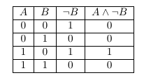
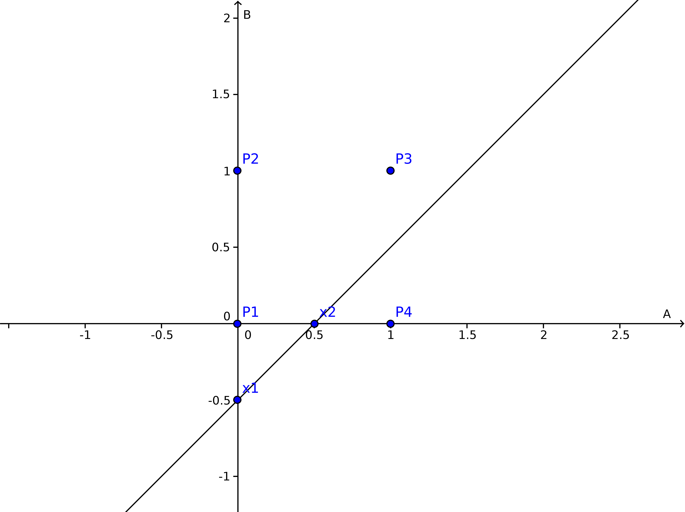
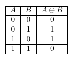
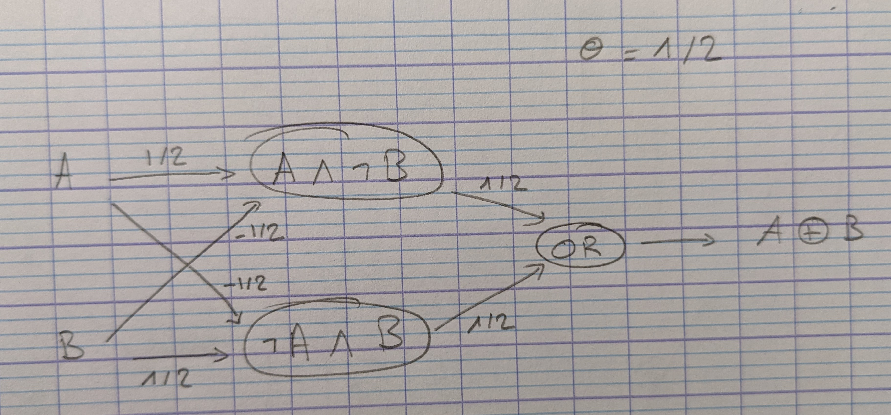
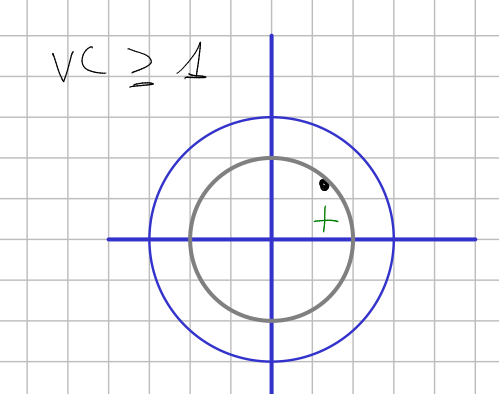
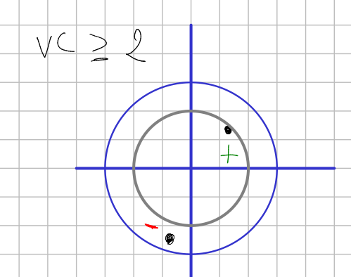
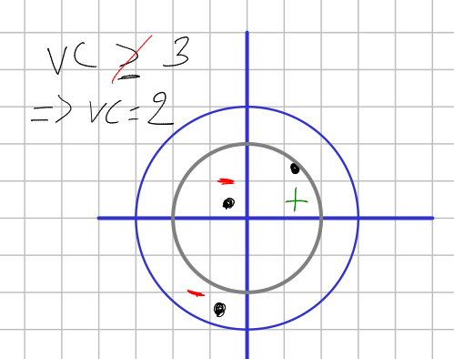

# Machine Learning - Problem Set 1

## Question 1

Where we are doing supervised learning, we have mostly assumed a deterministic function. Imagine instead a world where we are trying to capture a non-deterministic function. In this case, we might see training pairs where the x value appears several times, but with different y values. For example, we might use attributes of humans to the probability that they have had chicken pox. In that case, we might see the same kind of person many times but only sometimes they may have had chicken pox.

We would like to build a learning algorithm that will compute the probability that a person has chicken pox. So, given a set of training data where each instance is mapped to 1 for true or 0 for false:
1. Derive the proper error function to use for finding the ML hypothesis using Bayes’ Rule. You should go through a similar process as the one used to derive least squared error in the lessons.
2. Compare and contrast your result to the rule we derived for a deterministic function perturbed by zero-mean gaussian noise. What would a normal neural network using sum of squared errors do with these data? What if the data consisted of x,y pairs where y was an estimate of the probability instead of 0s and 1s

### 1.

$$h_{ML} = argmax_{h} Pr[D|h]$$
$$ = argmax_{h} \prod_i Pr[d_i|h]$$
$$ = argmax_{h} \prod_i \frac{1}{\sqrt{2\pi\sigma^2}} e^{-\frac{(d_i - h(x_i))^2}{2\sigma^2}}$$
$$ = argmax_{h} \prod_i e^{-\frac{(d_i - h(x_i))^2}{2\sigma^2}}$$
$$ ln(h_{ML}) = argmax_{h} \sum_i -\frac{(d_i - h(x_i))^2}{2\sigma^2}$$
$$ = argmax_{h} -\sum_i (d_i - h(x_i))^2$$
$$ = argmin_{h} \sum_i (d_i - h(x_i))^2$$
$$ = argmin_h SSD(d, h)$$

## Question 2

Design a two-input perceptron that implements the boolean function $A \land \neg B$. Design a two-layer network of perceptrons that implements $A \oplus B$ (where $\oplus$ is XOR).

### $A \land \neg B$

Let's first explicit the truth table of $A \land \neg B$.

Let's draw the 4 different cases in a 2D space in figure \ref{fig:2}. The point $P1$ represents the case where $A = 0$ and $B = 0$. The point $P2$ represents the case where $A = 0$ and $B = 1$. The point $P3$ represents the case where $A = 1$ and $B = 1$. The point $P4$ represents the case where $A = 1$ and $B = 0$.

A perceptron that implements the boolean function $A \land \neg B$ is a perceptron that computes an halfplane that contains $P4$ but not $P1$, $P2$ and $P3$.

Therefore we can parametrize that perceptron as follow:
$$ y = w_a x_a + w_b x_b $$
$$ \theta = 1/2 $$
$$ w_a = 1/2 $$
$$ w_b = -1/2 $$

### $A \oplus B$

Let's first explicit the truth table of $A \oplus B$.

We notice that XOR is the same as $A \land \neg B$ or $\neg A \land B$.

Then a 2-layer network of perceptrons that implements $A \oplus B$ should be like the one in following figure.

## Question 3

Derive the perceptron training rule and gradient descent training rule for a single unit with output, where $\omicron = \omega_0 + \omega_1 x_1 + \omega_1 x_1^2 + \dots + \omega_n x_n + \omega_n x_n^2$. What are the advantages of using gradient descent training rule for training neural networks over the perceptron training rule?

### Perceptron Rule

We define $$\hat{y} = (\omicron \ge 0)$$
Then we use $$\Delta \omega_i = \eta (y - \hat{y}) x_i$$
Then we adjust the weights, $$\omega_i \leftarrow \omega_i + \Delta \omega_i$$

### Gradient Descent Rule

We define $$E(\omega) = \frac{1}{2} \sum_{x, y \in D} (y - \omicron)^2$$
Then we derive $$\frac{\partial E}{\partial \omega_i} = \frac{\partial \omicron}{\partial \omega_i} \frac{1}{2}\sum_{x, y \in D} (y - \omicron)^2 $$
$$ = \frac{1}{2}\sum_{x, y \in D} (y - \omicron) \frac{\partial \omicron}{\partial \omega_i} * (- \sum_j \omega_j x_j - \sum_j \omega_j x_j^2 )$$
$$ = \sum_{x, y \in D} (y - \omicron) (-x_i -x_i^2)$$
$$ = - \sum_{x, y \in D} (y - \omicron) (x_i+x_i^2)$$
So we have $\Delta \omega_i - \eta (y = \omicron) (x_i + x_i^2)$.

### Advantages of Gradient Descent over Perceptron

The gradient descent gives us more information for the update process of the weights. The gradient descent is more robust than the perceptron rule.

## Question 4

Explain how one can use Decision Trees to perform regression? Show that when the error function is
squared error that the expected value at any leaf is the mean. Take the [Boston Housing dataset](http://lib.stat.cmu.edu/datasets/boston) and use Decision Trees to perform regression

In Decision Trees for Classification, we saw how the tree asks right questions at the right node in order to give accurate and efficient classifications. The way this is done in Classification Trees is by using 2 measures , namely Entropy and Information Gain. But since we are predicting continuous variables, we cannot calculate the entropy and go through the same process. We need a different measure now. A measure that tells us how much our predictions deviate from the original target and that’s the entry-point of mean square error.

## Question 5

Suggest a lazy version of the eager decision tree learning algorithm ID3. What are the advantages and disadvantages of your lazy algorithm compared to the original eager algorithm?

## Question 6

Imagine you had a learning problem with an instance space of points on the plane and a target function that you knew took the form of a line on the plane where all points on one side of the line are positive and all those on the other are negative. If you were constrained to only use decision tree or nearest-neighbor learning, which would you use? Why?

I think KNN should be good. As we know that the data is linearly separable, we can use KNN without feer to outliers. Also KNN is very fast.

## Question 7

Give the VC dimension of these hypothesis spaces, briefly explaining your answers:
1. An origin-centered circle (2D)
2. An origin-centered sphere (3D)

### 1. An origin-centered circle (2D)

The VC dimension of an origin-centered circle is 2.

### 1. An origin-centered sphere (3D)

The VC dimension of an origin-centered shere is also 2.

There is the same problem with 3 points in the sphere.
