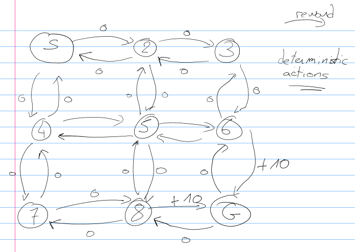

# Machine Learning - Problem Set 2

## Question 1

> ​You have to communicate a signal in a language that has 3 symbols A, B and C. The probability of observing A is 50% while that of observing B and C is 25% each. Design an appropriate encoding for this language. What is the entropy of this signal in bits?

Since the probability of observing A is 50%, we can encode A with a single bit. Since the probability of observing B and C is 25%, we can encode B and C with two bits. The encoding is the following:

| Symbol | Encoding |
|--------|----------|
| A      | 0        |
| B      | 10       |
| C      | 11       |

We can also represent the encoding as a binary tree:

The entropy of this signal is:

$$ H = -\sum_{i=1}^3 p_i \log_2 p_i = -\frac{1}{2} \log_2 \frac{1}{2} - \frac{1}{4} \log_2 \frac{1}{4} - \frac{1}{4} \log_2 \frac{1}{4} = 1.5 $$
$$ H = 1.5 \text{ bits} $$

## Question 2

> Show that the K-means procedure can be viewed as a special case of the EM algorithm applied to an appropriate mixture of Gaussian densities model.

A Gaussian Mixture is a function that is comprised of several Gaussians, each identified by $k \in \{1, \dots, K\}$, where $K$ is the number of clusters of our dataset. Each Gaussian $k$ in the mixture is comprised of the following parameters:

- A mean $\mu$ that defines its center.
- A covariance $\Sigma$ that defines its width.
- A mixing probability $\pi$ that defines how big or small the Gaussian function will be.

EM is an algorithm for learning models with hidden variables. The goal of EM is to find the model that maximizes the marginal likelihood of the data (likelihood with hidden variables summed out).. The algorithm alternates between two steps:

1. Expectation step: estimate hidden variables given the model, evaluation of the expectation, where the expectation of the likelihood is calculated taking into account the last observed variables
2. Maximization step: estimate the model given the hidden variable estimates, the maximum likelihood of the parameters is estimated by maximizing the likelihood found in step E.

The K-means algorithm is a special case of the EM algorithm applied to an appropriate mixture of Gaussian densities model. K-means can be seen as trying to find the values of hidden variables $z_i$ (cluster assignments) and fit the mixture model assuming mixture weights are equal, $\pi_k = \frac{1}{K}$, and variances are shared spherical, $\Sigma_k = \sigma I$, (the value of $\sigma$ doesn't change the optimal $z$  and $\mu$, so we can just assume it's fixed).

Therefore K-Means is only a special case of the EM algorithm. The difference is that K-means is hard clustering, while EM is soft clustering. Hard clustering means that each data point belongs to only one cluster, while soft clustering means that each data point belongs to all clusters to some extent (with a probability). In practice that means that all of the hidden variables $z_n \in \{0, 1\}$.

We can also see the similarity between the expectation of the hidden variables in the case of EM and K-means:

$$ E(Z_{ij}) = \frac{P(x = x_i | \mu = \mu_j)}{\Sigma_i^n P(x = x_i | \mu = \mu_j)} $$

$$ \mu_j = \frac{\sum_{i=1}^n E(Z_{ij}) x_i}{\sum_{i=1}^n E(Z_{ij})} $$

## Question 3

> ​Plot the direction of the first and second PCA components in the figures given​.
>
> 

The first PCA component is the direction that maximazes the variance of the data. The second PCA component is the direction that maximizes the variance and which is orthogonal to the first PCA component.

## Question 4

> ​Which clustering method(s) is most likely to produce the following results at $k = 2$ ? Choose the most likely method(s) and briefly explain why it/they will work better where others will not in at most 3 sentences.
>
> Here are the five clustering methods you can choose from:
> - Hierarchical clustering with single link
> - Hierarchical clustering with complete link
> - Hierarchical clustering with average link
> - K-means
> - EM
>
> 1. 
> 2. 
> 3. 

**Hierarchical clustering with single link**
: HAC-SLINK iteratively merges the two clusters whose two closest members have the smallest distance (or: the two clusters with the smallest minimum pairwise distance).

**Hierarchical clustering with complete link**
: HAC-CLINK iteratively merges the two clusters whose merger has the smallest diameter (or: the two clusters with the smallest maximum pairwise distance).

**Hierarchical clustering with average link**
: HAC-ALINK iteratively merges the two clusters whose the average distance between each cluster is the smalest.

**K-means**
: K-means is a hard clustering algorithm that iteratively assigns each data point to the cluster with the closest mean.

**EM**
: EM is a soft clustering algorithm that iteratively assigns each data point to all clusters to some extent (with a probability).

1.
	- [x] HAC-SLINK: We can see that the distance between each point of a same cluster is less than the disatance between points of different clusters. Therefore, HAC-SLINK produces that result.
	- [x] HAC-CLINK: Same reasoning as above.
	- [x] HAC-ALINK: Same reasoning as above.
	- [ ] K-means: K-means is  biased towards spherical clusters. Therefore the two elongated clusters are probably not a result of K-means.
	- [ ] EM: Can be a result of EM, in the case that the two initial clusters are in the center of the two elongated clusters. But in general, EM would probably not produce that result.
2.
	- [ ] HAC-SLINK: Since some points of different clusters are closer to each other than some points of the same cluster (points at border), HAC-SLINK would not produce that result.
	- [ ] HAC-CLINK: Same reasoning as above.
	- [ ] HAC-ALINK: Same reasoning as above.
	- [x] K-means: Clusters are spherical, therefore K-means is a perfect candidate.
	- [x] EM: Same reasoning as above.
3.
	- [ ] HAC-SLINK: Since some points of different clusters are closer to each other than some points of the same cluster (points in the middle), HAC-SLINK would not produce that result.
	- [ ] HAC-CLINK: Same reasoning as above.
	- [ ] HAC-ALINK: Same reasoning as above.
	- [ ] K-means: K-means does not permit overlapping clusters. Therefore, K-means would not produce that result.
	- [x] EM: Typical result of a soft clustering algorithm as EM.

## Question 5

> You receive the following letter -
>
> Dear Friend,
>
> Some time ago, I bought this old house, but found it to be haunted by ghostly sardonic laughter. As a result it is hardly habitable. There is hope, however, for by actual testing I have found that
this haunting is subject to certain laws, obscure but infallible, and that the laughter can be
affected by my playing the organ or burning incense.
>
> In each minute, the laughter occurs or not, it shows no degree. What it will do during the ensuing minute depends, in the following exact way, on what has been happening during the preceding minute:
>
> Whenever there is laughter, it will continue in the succeeding minute unless I play the organ, in
which case it will stop. But continuing to play the organ does not keep the house quiet. I notice,
however, that whenever I burn incense when the house is quiet and do not play the organ it
remains quiet for the next minute.
>
> At this minute of writing, the laughter is going on. Please tell me what manipulations of incense
and organ I should make to get that house quiet, and to keep it so.
> Sincerely,
> At Wit's End
>
> 1. Formulate this problem as an MDP. (For the sake of uniformity, formulate it as a continuing discounted problem, with gamma = 0.9. Let the reward be +1 on any transition into the silent state, and -1 on any transition into the laughing state). Explicitly give the state set, action sets, state transition, and reward function.
> 2. Start with policy pi(laughing) = pi(silent) = (incense, no organ). Perform a couple of steps of policy iteration (by hand!) until you find an optimal policy. (Clearly show and label each step. If you are taking a lot of iteration, stop and reconsider your formulation!)
> 3. Do a couple of steps of value iteration as well.
> 4. What are the resulting optimal state-action values for all state-action pairs?
> 5. What is your advice to "At Wit's End"?

1.
	- State set: $\{L, Q\}$, where $L$ indicates that there is laughter in the room, and $Q$ indicates that the room is quiet.
	- Action set: $\{O \land I, O \land ¬I, ¬O \land I, ¬O \land ¬I\}$, where $O$ corresponds to playing the organ, and $I$ corresponds to burning incense.
	- State transition:
		- $T(L, O \land I, L) = P(L \mid L, O \land I)$ = 0
		- $T(L, O \land ¬I, L) = P(L \mid L, O \land ¬I)$ = 0
		- $T(L, ¬O \land I, L) = P(L \mid L, ¬O \land I)$ = 1
		- $T(L, ¬O \land ¬I, L) = P(L \mid L, ¬O \land ¬I)$ = 1
		- $T(L, O \land I, Q) = P(Q \mid L, O \land I)$ = 1
		- $T(L, O \land ¬I, Q) = P(Q \mid L, O \land ¬I)$ = 1
		- $T(L, ¬O \land I, Q) = P(Q \mid L, ¬O \land I)$ = 0
		- $T(L, ¬O \land ¬I, Q) = P(Q \mid L, ¬O \land ¬I)$ = 0
		- $T(Q, O \land I, L) = P(L \mid Q, O \land I)$ = 1
		- $T(Q, O \land ¬I, L) = P(L \mid Q, O \land ¬I)$ = 1
		- $T(Q, ¬O \land I, L) = P(L \mid Q, ¬O \land I)$ = 0
		- $T(Q, ¬O \land ¬I, L) = P(L \mid Q, ¬O \land ¬I)$ = 1
		- $T(Q, O \land I, Q) = P(Q \mid Q, O \land I)$ = 0
		- $T(Q, O \land ¬I, Q) = P(Q \mid Q, O \land ¬I)$ = 0
		- $T(Q, ¬O \land I, Q) = P(Q \mid Q, ¬O \land I)$ = 1
		- $T(Q, ¬O \land ¬I, Q) = P(Q \mid Q, ¬O \land ¬I)$ = 0
	- Reward function:
		- $R(L, _) = -1$
		- $R(Q, _) = +1$

2.
	
	Policy iteration:
	- $\Pi_0(L) = (¬O \land I)$
	- $\Pi_0(Q) = (¬O \land I)$

	- $$V(Q) = R(Q) + \gamma \sum_{s' \in S} T(Q, \Pi_0(Q), s') V(s')$$
	$$V(Q) = 1 + 0.9 (T(Q, ¬O \land I, Q) V(Q) + T(Q, ¬O \land I, L) V(L)) = 1 + 0.9 (1 V(Q) + 0 V(L)) = 1 + 0.9 V(Q)$$
	- $$V(L) = R(L) + \gamma \sum_{s' \in S} T(L, \Pi_0(L), s') V(s')$$
	$$V(L) = -1 + 0.9 (T(L, ¬O \land I, Q) V(Q) + T(L, ¬O \land I, L) V(L)) = -1 + 0.9 (0 V(Q) + 1 V(L)) = -1 + 0.9 V(L)$$
	- $$V(Q) = 10$$
	- $$V(L) = -10$$
	- $$Q \rightarrow O \land I: +1 + 0.9 (1 * -10 + 0 * 10) = -9$$
	- $$Q \rightarrow O \land ¬I: +1 + 0.9 (1 * -10 + 0 * 10) = -9$$
	- $$Q \rightarrow ¬O \land I: +1 + 0.9 (1 * -10 + 0 * 10) = -9$$
	- $$Q \rightarrow ¬O \land ¬I: +1 + 0.9 (1 * -10 + 0 * 10) = -9$$
	- $$\Pi_1(Q) = (¬O \land I)$$
	- $$L \rightarrow O \land I: -1 + 0.9 (0 * -10 + 1 * 10) = 9$$
	- $$L \rightarrow O \land ¬I: -1 + 0.9 (0 * -10 + 1 * 10) = 9$$
	- $$L \rightarrow ¬O \land I: -1 + 0.9 (0 * -10 + 1 * 10) = 9$$
	- $$L \rightarrow ¬O \land ¬I: -1 + 0.9 (0 * -10 + 1 * 10) = 9$$
	- $$\Pi_1(L) = (¬O \land I)$$

	<!-- incorrect -->

3.
	

	- $V_Q = 0$
	- $V_L = 0$

	- $$V_Q = R(Q, \_) + \max_{a \in A(s)} \gamma \sum_{s' \in S} T(Q, a, s') V_Q$$
	- $$V_Q = +1 + 0.9 \max \{ T(Q, O \land I, Q) V_Q + T(Q, O \land I, L) V_L, T(Q, ¬O \land I, Q) V_Q + T(Q, ¬O \land I, L) V_L, T(Q, O \land ¬I, Q) V_Q + T(Q, O \land ¬I, L) V_L, T(Q, ¬O \land ¬I, Q) V_Q + T(Q, ¬O \land ¬I, L) V_L \}$$
	$$V_Q = 1 + 0.9 \max \{ 0, 0, 0, 0 \}$$
	$$V_Q = 1$$
	- $$V_L = R(L, \_) + \max_{a \in A(s)} \gamma \sum_{s' \in S} T(L, a, s') V_L$$
	- $$V_L = -1 + 0.9 \max \{ T(L, O \land I, Q) V_Q + T(L, O \land I, L) V_L, T(L, ¬O \land I, Q) V_Q + T(L, ¬O \land I, L) V_L, T(L, O \land ¬I, Q) V_Q + T(L, O \land ¬I, L) V_L, T(L, ¬O \land ¬I, Q) V_Q + T(L, ¬O \land ¬I, L) V_L \}$$
	$$V_L = -1 + 0.9 \max \{ 0, 0, 0, 0 \}$$
	$$V_L = -1$$

	- $$V_Q = R(Q, \_) + \max_{a \in A(s)} \gamma \sum_{s' \in S} T(Q, a, s') V_Q$$
	- $$V_Q = +1 + 0.9 \max \{ T(Q, O \land I, Q) V_Q + T(Q, O \land I, L) V_L, T(Q, ¬O \land I, Q) V_Q + T(Q, ¬O \land I, L) V_L, T(Q, O \land ¬I, Q) V_Q + T(Q, O \land ¬I, L) V_L, T(Q, ¬O \land ¬I, Q) V_Q + T(Q, ¬O \land ¬I, L) V_L \}$$
	$$V_Q = 1 + 0.9 \max \{ -1, 1, -1, -1 \}$$
	$$V_Q = 1.9$$
	- $$V_L = R(L, \_) + \max_{a \in A(s)} \gamma \sum_{s' \in S} T(L, a, s') V_L$$
	- $$V_L = -1 + 0.9 \max \{ T(L, O \land I, Q) V_Q + T(L, O \land I, L) V_L, T(L, ¬O \land I, Q) V_Q + T(L, ¬O \land I, L) V_L, T(L, O \land ¬I, Q) V_Q + T(L, O \land ¬I, L) V_L, T(L, ¬O \land ¬I, Q) V_Q + T(L, ¬O \land ¬I, L) V_L \}$$
	$$V_L = -1 + 0.9 \max \{ -1, 1, -1, -1 \}$$
	$$V_L = -0.1$$

	- $$V_Q = R(Q, \_) + \max_{a \in A(s)} \gamma \sum_{s' \in S} T(Q, a, s') V_Q$$
	- $$V_Q = +1 + 0.9 \max \{ T(Q, O \land I, Q) V_Q + T(Q, O \land I, L) V_L, T(Q, ¬O \land I, Q) V_Q + T(Q, ¬O \land I, L) V_L, T(Q, O \land ¬I, Q) V_Q + T(Q, O \land ¬I, L) V_L, T(Q, ¬O \land ¬I, Q) V_Q + T(Q, ¬O \land ¬I, L) V_L \}
	$$
	$$V_Q = 1 + 0.9 \max \{ -0.1, 1.9, -0.1, -0.1 \}$$
	$$V_Q = 2.71$$
	- $$V_L = R(L, \_) + \max_{a \in A(s)} \gamma \sum_{s' \in S} T(L, a, s') V_L$$
	- $$V_L = -1 + 0.9 \max \{ T(L, O \land I, Q) V_Q + T(L, O \land I, L) V_L, T(L, ¬O \land I, Q) V_Q + T(L, ¬O \land I, L) V_L, T(L, O \land ¬I, Q) V_Q + T(L, O \land ¬I, L) V_L, T(L, ¬O \land ¬I, Q) V_Q + T(L, ¬O \land ¬I, L) V_L \}$$
	$$V_L = -1 + 0.9 \max \{ -0.1, 1.9, -0.1, -0.1 \}$$
	$$V_L = 0.71$$

4.

5. If there is laughter, play the organ; if room is quite, do not play the organ and burn
incense

## Question 6

> ​Use the Bellman equation to calculate $Q(s, a1)$ and $Q(s, a2)$ for the scenario shown in the figure. Consider two different policies:
> - Total exploration: All actions are chosen with equal probability.
> - Greedy exploitation: The agent always chooses the best action.
> Note that the rewards / next states are stochastic for the actions $a1', a2' and a3'$. Assume that the probabilities for the outcome of these actions are all equal. Assume that reward gathering / decision making stops at the empty circles at the bottom.
>
> 

We have $Q(s, a) = R(s) + \gamma \sum_{s' \in S} T(s, a, s') \max_{a'} Q(s', a')$.

- Total exploration

	We start by computing the state-action values for state $s_1'$ and state $s_2'$:
	- $$Q(s_1', a_1') = R(s_1') + \gamma \sum_{s' \in S} T(s_1', a_1', s') \max_{a'} Q(s', a') = 0 + 1 (1/2 * \max \{ 1 \} + 1/2 * \max \{ 2 \}) = 3/2$$
	- $$Q(s_1', a_2') = R(s_1') + \gamma \sum_{s' \in S} T(s_1', a_2', s') \max_{a'} Q(s', a') = 0 + 1 (1/2 * \max \{ 1 \} + 1/2 * \max \{ 2 \}) = 3/2$$
	- $$Q(s_1', a_3') = R(s_1') + \gamma \sum_{s' \in S} T(s_1', a_3', s') \max_{a'} Q(s', a') = 0 + 1 (1/2 * \max \{ 1 \} + 1/2 * \max \{ 2 \}) = 3/2$$
	- $$Q(s_2', a_1') = R(s_2') + \gamma \sum_{s' \in S} T(s_2', a_1', s') \max_{a'} Q(s', a') = 0 + 1 (1/2 * \max \{ 0 \} + 1/2 * \max \{ 6 \}) = 3$$

	We can now compute the state-action value for state $s$:
	- $$Q(s, a_1) = R(s) + \gamma \sum_{s' \in S} T(s, a_1, s') \max_{a'} Q(s', a') = 1 + 1 (1/2 * \max \{ 3/2 \} + 1/2 * \max \{ 3/2 \}) = 5/2$$
	- $$Q(s, a_2) = R(s) + \gamma \sum_{s' \in S} T(s, a_2, s') \max_{a'} Q(s', a') = 0 + 1 (1/2 * \max \{ 3/2 \} + 1/2 * \max \{ 3 \}) = 9/4$$

- Greedy exploitation

	In that case, the state-action values for the $s1'$ and $s2'$ states are unchanged but those for $s$ reflect  the fact that we now  take the best action:
	- $$Q(s, a_1) = 1 + Q(s', a_1') = 1 + 3/2 = 5/2$$
	- $$Q(s, a_2) = 0 + Q(s', a_3') = 0 + 3 = 3$$

The *best* action in state $s$ is now $a_2$, whereas it was $a_1$ for the total exploration policy.

## Question 7

> Consider the following simple grid-world problem. (Actions are N, S, E, W and are deterministic.) Our goal is to maximize the following reward:
> - 10 for the transition from state 6 to G
> - 10 for the transition from state 8 to G
> - 0 for all other transitions
>
> |S | 2 | 3|
> |-|-|-|
> |4 | 5 | 6|
> |7 | 8 | G|
>
> 1. Draw the Markov Decision Process associated to the system.
> 2. Compute the value function for each state for iteration 0, 1, 2 and 3 with γ=0.8

1.
	

2.
	- initialization:
		- $$V(S) = 0$$
		- $$V(2) = 0$$
		- $$V(3) = 0$$
		- $$V(4) = 0$$
		- $$V(5) = 0$$
		- $$V(6) = 0$$
		- $$V(7) = 0$$
		- $$V(8) = 0$$
		- $$V(G) = 0$$
	- iteration 1:
		- $$V(S) = R(S) + \gamma \max \{ T(S, E, 2) V(2), T(S, S, 4) V(4) \} = 0 + 0.8 \max \{ 0, 0 \} = 0$$
		- $$V(2) = R(2) + \gamma \max \{ T(2, E, 3) V(3), T(2, W, S) V(S), T(2, S, 5) V(5) \} = 0 + 0.8 \max \{ 0, 0, 0 \} = 0$$
		- $$V(3) = R(3) + \gamma \max \{ T(3, W, 2) V(2), T(3, S, 6) V(6) \} = 0 + 0.8 \max \{ 0, 0 \} = 0$$
		- $$V(4) = R(4) + \gamma \max \{ T(4, E, 5) V(5), T(4, N, S) V(S), T(4, S, 7) V(7) \} = 0 + 0.8 \max \{ 0, 0, 0 \} = 0$$
		- $$V(5) = R(5) + \gamma \max \{ T(5, E, 6) V(6), T(5, W, 4) V(4), T(5, S, 8) V(8), T(5, N, 2) V(2) \} = 0 + 0.8 \max \{ 0, 0, 0, 0 \} = 0$$
		- $$V(6) = R(6) + \gamma \max \{ T(6, W, 5) V(5), T(6, N, 3) V(3), T(6, S, G) V(G) \} = 0 + 0.8 \max \{ 0, 0, 0 \} = 0$$
		- $$V(7) = R(7) + \gamma \max \{ T(7, E, 8) V(8), T(7, N, 4) V(4) \} = 0 + 0.8 \max \{ 0, 0 \} = 0$$
		- $$V(8) = R(8) + \gamma \max \{ T(8, E, G) V(G), T(8, W, 7) V(7), T(8, N, 5) V(5) \} = 0 + 0.8 \max \{ 0, 0, 0 \} = 0$$
		- $$V(G) = R(G) + \gamma \max \{ T(G, W, 8) V(8), T(G, N, 6) V(6) \} = 10 + 0.8 \max \{ 0, 0 \} = 10$$
	- iteration 2:
		- $$V(S) = R(S) + \gamma \max \{ T(S, E, 2) V(2), T(S, S, 4) V(4) \} = 0 + 0.8 \max \{ 0, 0 \} = 0$$
		- $$V(2) = R(2) + \gamma \max \{ T(2, E, 3) V(3), T(2, W, S) V(S), T(2, S, 5) V(5) \} = 0 + 0.8 \max \{ 0, 0, 0 \} = 0$$
		- $$V(3) = R(3) + \gamma \max \{ T(3, W, 2) V(2), T(3, S, 6) V(6) \} = 0 + 0.8 \max \{ 0, 0 \} = 0$$
		- $$V(4) = R(4) + \gamma \max \{ T(4, E, 5) V(5), T(4, N, S) V(S), T(4, S, 7) V(7) \} = 0 + 0.8 \max \{ 0, 0, 0 \} = 0$$
		- $$V(5) = R(5) + \gamma \max \{ T(5, E, 6) V(6), T(5, W, 4) V(4), T(5, S, 8) V(8), T(5, N, 2) V(2) \} = 0 + 0.8 \max \{ 0, 0, 0, 0 \} = 0$$
		- $$V(6) = R(6) + \gamma \max \{ T(6, W, 5) V(5), T(6, N, 3) V(3), T(6, S, G) V(G) \} = 0 + 0.8 \max \{ 0, 0, 10 \} = 8$$
		- $$V(7) = R(7) + \gamma \max \{ T(7, E, 8) V(8), T(7, N, 4) V(4) \} = 0 + 0.8 \max \{ 0, 0 \} = 0$$
		- $$V(8) = R(8) + \gamma \max \{ T(8, E, G) V(G), T(8, W, 7) V(7), T(8, N, 5) V(5) \} = 0 + 0.8 \max \{ 10, 0, 0 \} = 8$$
		- $$V(G) = R(G) + \gamma \max \{ T(G, W, 8) V(8), T(G, N, 6) V(6) \} = 10 + 0.8 \max \{ 0, 0 \} = 10$$
	- iteration 3:
		- $$V(S) = R(S) + \gamma \max \{ T(S, E, 2) V(2), T(S, S, 4) V(4) \} = 0 + 0.8 \max \{ 0, 0 \} = 0$$
		- $$V(2) = R(2) + \gamma \max \{ T(2, E, 3) V(3), T(2, W, S) V(S), T(2, S, 5) V(5) \} = 0 + 0.8 \max \{ 0, 0, 0 \} = 0$$
		- $$V(3) = R(3) + \gamma \max \{ T(3, W, 2) V(2), T(3, S, 6) V(6) \} = 0 + 0.8 \max \{ 0, 8 \} = 6.4$$
		- $$V(4) = R(4) + \gamma \max \{ T(4, E, 5) V(5), T(4, N, S) V(S), T(4, S, 7) V(7) \} = 0 + 0.8 \max \{ 0, 0, 0 \} = 0$$
		- $$V(5) = R(5) + \gamma \max \{ T(5, E, 6) V(6), T(5, W, 4) V(4), T(5, S, 8) V(8), T(5, N, 2) V(2) \} = 0 + 0.8 \max \{ 8, 0, 8, 0 \} = 6.4$$
		- $$V(6) = R(6) + \gamma \max \{ T(6, W, 5) V(5), T(6, N, 3) V(3), T(6, S, G) V(G) \} = 0 + 0.8 \max \{ 0, 0, 10 \} = 8$$
		- $$V(7) = R(7) + \gamma \max \{ T(7, E, 8) V(8), T(7, N, 4) V(4) \} = 0 + 0.8 \max \{ 8, 0 \} = 6.4$$
		- $$V(8) = R(8) + \gamma \max \{ T(8, E, G) V(G), T(8, W, 7) V(7), T(8, N, 5) V(5) \} = 0 + 0.8 \max \{ 10, 0, 0 \} = 8$$
		- $$V(G) = R(G) + \gamma \max \{ T(G, W, 8) V(8), T(G, N, 6) V(6) \} = 10 + 0.8 \max \{ 8, 8 \} = 16.4$$

## Question 8

> Find a Nash Equilibrium in each case. The rows denote strategies for Player 1 and columns
denote strategies for Player 2.
>
> | |A | B |
> |-|-|-|
> | A | 2,1 | 0,0 |
> |B | 0,0 | 1,2 |
>
> | |A | B |
> |-|-|-|
> |A | 2,1 | 1,2 |
> |B | 1,2 | 2,1 |
>
> | |L | R |
> |-|-|-|
> |T | 2,2 | 0,0 |
> |B | 0,0 | 1,1 |

| |A | B |
|-|-|-|
| A | **2,1** | 0,0 |
|B | 0,0 | **1,2** |

| |A | B |
|-|-|-|
|A | 2,1 | 1,2 |
|B | 1,2 | 2,1 |

| |L | R |
|-|-|-|
|T | **2,2** | 0,0 |
|B | 0,0 | 1,1 |

## Referencies

- [https://alliance.seas.upenn.edu/~cis520/wiki/index.php?n=Lectures.EM](https://alliance.seas.upenn.edu/~cis520/wiki/index.php?n=Lectures.EM)
- [https://nlp.stanford.edu/IR-book/completelink.html](https://nlp.stanford.edu/IR-book/completelink.html)
- [https://www.youtube.com/watch?v=iiUVbKn1XZs&list=PL6Xpj9I5qXYGhsvMWM53ZLfwUInzvYWsm&index=69](https://www.youtube.com/watch?v=iiUVbKn1XZs&list=PL6Xpj9I5qXYGhsvMWM53ZLfwUInzvYWsm&index=69)
- [https://saylordotorg.github.io/text_introduction-to-economic-analysis/s17-02-nash-equilibrium.html](https://saylordotorg.github.io/text_introduction-to-economic-analysis/s17-02-nash-equilibrium.html)